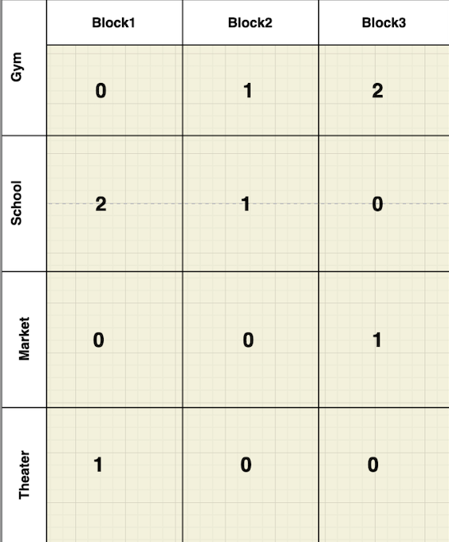

### Problem statement
Given an array of blocks and an array of facilities, find the best block that will give the least distance to all facilities.

##### Example 1:

	Input1: blocks = [
   		{'gym': true, 'school': false, 'market': true, 'theater': false},
		{'gym': false, 'school': false, 'market': true, 'theater': true},
		{'gym': false, 'school': true, 'market': false, 'theater': true},
	]
	Input2: facilities = ['gym', 'school', 'market', 'theater']

So we're asked to find the best block that gives optimal (minimum) distance to all given facilities compare to other blocks.

The 'true' value indicates that the facility is available in that block.

If we put this in a tabular fashion, it would be like this -

Let's take the example of block1. We say the distance to the facility 'School' in this block is 2 because this facility is available only in Block3, and we need to walk there two blocks from Block1.
We put 0 when the facility is available in the block. With this logic, we come up the above figures on the table.

The solution is -

	Find the maximum distance (to travel) for each block and choose the block that givies the minimum value.

So maximum distance - across all facilities (rows) for (block 1) is 2, maximum distance(block 2) is 1,
maximum distance(block 3) is 2 and therefore block2 is the answer as it's the minimum of all maximum distances.

## Explanation

### Solution1 (Brute force)

For each block, if the facility is not available,
- traverse left, traverse right and find the optimal distance (minimum of the two).
- Do the first step for all facilities
- Find the maximum of all distances

Once we get maximum distance to traverse in each block, choose the block that has the minimum (max distance) compare to other blocks.

#### Complexity:

Since, for each block, we have to traverse left and right direction in the array,
That means, the outer loop will track each block, and there will be two inner loops - one for traversing left and other for right direction.
I think the complexity would be -

	Time complexity = O(n³)

#### Can we do it better?

### Solution2 (Left & Right scanning)

We start with filling all the blocks with facility (with false value) as _Infinity_ value.

Left scanning:
- We start with left to right scanning (for loop)
- In each iteration (and for all facilities), if the facility, 'x' is available, mark the index(position) as _0_ for 'x' for that block
- Else (facility not available), mark the index (position) as index(previous block for the facility) + _1_
- there's edge case to consider for the leftmost block as it doesn't have previous block.

Right scanning:
- In each iteration, if the facility is available, mark the index(position) as _0_ and check whether the same facility in the previous block is not 0. If it's not 0, update its value as 1 because that's the distance (min) to walk through this block.
- Else (facility not available), mark the index (position) as the min(distance of this facility in previous block, distance of this facility in next block)
- there's edge case to consider for the rightmost block as it doesn't have next block.

Finally, when we have figures of each block (as shown in the above figure), the solution to find the block that has the minimum (maximum of all distances to traverse for all facilities)

#### Complexity:

In this approach, we will be using one loop for left scanning and another loop for right scanning.

	Time complexity = 2 * O(n) = O(n)

