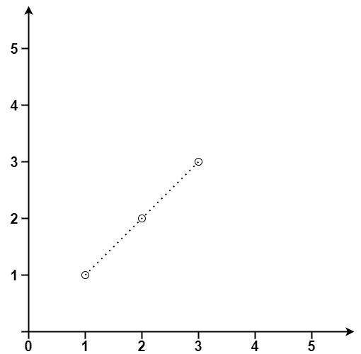

#### Max Points on a Line

[Leetcode link](https://leetcode.com/problems/max-points-on-a-line/)

Given an array of points where points[i] = [xi, yi] represents a point on the X-Y plane, return the maximum number of points that lie on the same straight line.

##### Example 1



```
Input: points = [[1,1],[2,2],[3,3]]
Output: 3
```

### Solution

- Iterate each point, p1 (co-ordinate) and find the slopes that can be formed with other point p2
- If points have the same slope, that means they lie on the same line
- Keep a track of all possible slopes and their counts
- Find the maximum value of a slope and return that.

For the step3, we create a hash structure and initialize/increment whenever we found a matching point (same slope value)

#### Time complexity = O(n²)

#### Space complexity = O(n)

###### Disclaimer: 
Though the solution is tested with common random points, it doesn't consider rare exceptional cases and we need to handle them separately.

