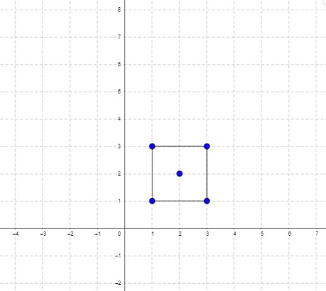

#### Minimum Area of a Rectangle

[Leetcode link](https://leetcode.com/problems/minimum-area-rectangle/)

You are given an array of points in the X-Y plane points where points[i] = [xi, yi].

Return the minimum area of a rectangle formed from these points, with sides parallel to the X and Y axes. If there is not any such rectangle, return 0.

##### Example 1



```
Input: points = [[1,1],[1,3],[3,1],[3,3],[2,2]]
Output: 4
```

### Solution

- Iterate each point, p1 (co-ordinate) and find the diagonal co-ordinate p2 (meaning whose p1x !== p2x and p1y !== p2y)
- In the above p1 & p2 form a diagonal line say M
- Find the opposite diagonal of M from the remaining co-ordinates and calculate the area.
- Keep on updating the minimum area calculation.

For the step3, we create a Set structure (for finding opposite diagonals) and we initialize it by converting all co-ordinates to string.

#### Time complexity = O(n²)

#### Space complexity = O(n)

### Can we do it better?
