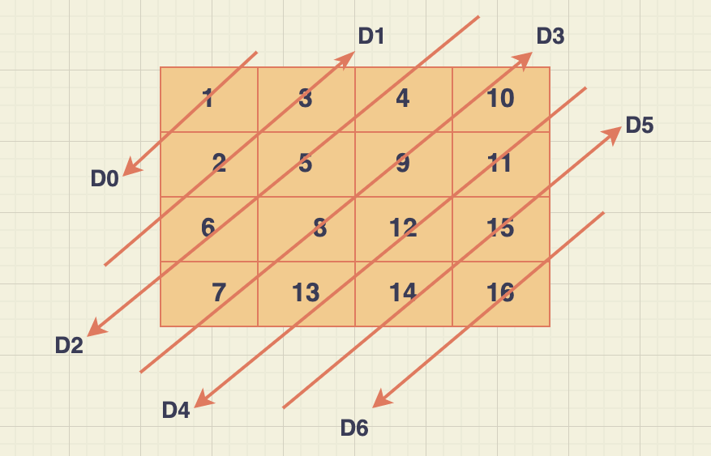
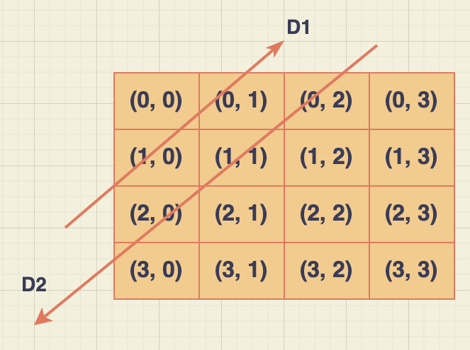

### Problem statement
Given an integer array of m x n dimensional array, print the array in ZigZag(diagonally) order.

##### Example 1:

	Input: nums = [
    [1, 3, 4, 10],
    [2, 5, 9, 11],
    [6, 8, 12, 15],
    [7, 13, 14, 16]
]

	Output: [1, 2, 3, 4, 5, 6, 7, 8, 9, 10, 11, 12, 13, 14, 15, 16]
because the numbers forming the sequence/range 1, 2, 3, 4, 5, 6 is there in the array and that range is the largest one.

As you can see in the figure above, It starts with diagonal D0 (down), then D1(up), D2(down), D3(up) and so on. You get the idea.

## Explanation

### Solution (diagonals based)

The solution lies in the relation between diagonals and the indices they're crossing.

Let's redraw the figure with the indices instead of the actual values occupying them.

If you see closely, the diagonal D1 is crossing indices (x,y) whose sum is '1' ([0,1] and [1,0]). Similarly, the diagonal D2 is crossing all indices whose sum is '2' ([2,0], [1,1] and [0,2])

Also, more closely, diagonals that cross indices whose sum is odd (as n D1, D3, D5 etc.) points UP whereas those crossing indices whose sum is even (D2, D4 etc.) points DOWN.

The direction 'UP' or 'DOWN' will indicate the order of the array.

With the above info, we need to create an array of diagonals whose indices will dictate what array elements to contain. Fo example, if it's D0 (first diagonal), it will contain only [0, 0] because the sum is 0. For D1, it will contain ([0,1] and [1,0]) and for Dk, it will contain all elements whose indices [i + j = k] respectively.

Also for the direction, if indices (i + j) of array element is even, it will be FIFO(First-in, First-out) order and for indices sum (i +j) of odd, it will be FILO (First-in Last-out) order.

In JS, FIFO is achieved by using array.push() and for FILO, it's achieved by array.unshift().

#### Complexity:

We're creating a new 2D array (array of diagonals) and parsing each individually to populate them. Since we're parsing all (2D) elements, complexity would be O(n²)

	Time complexity = O(n²)

And since we create a new 2D array, the space complexity would also be O(n²)

	Space complexity = O(n²)
