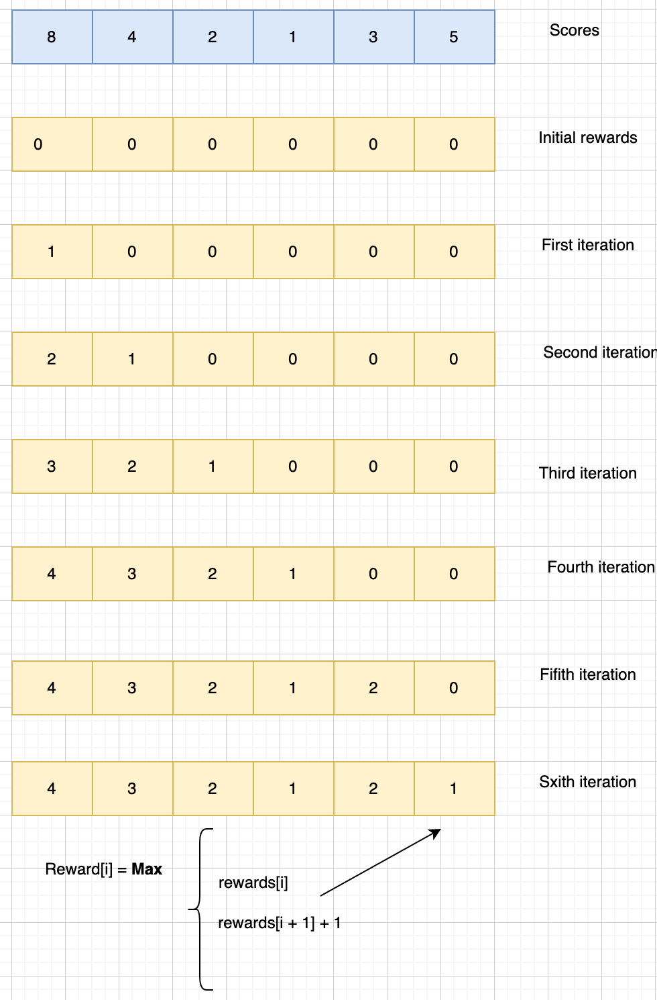

#### Min Candies distribution
[Leetcode link](https://leetcode.com/problems/candy/)

There are n children standing in a line. Each child is assigned a rating value given in the integer array ratings.

You are giving candies to these children subjected to the following requirements:

Each child must have at least one candy.
Children with a higher rating get more candies than their neighbors.
Return the minimum number of candies you need to have to distribute the candies to the children.

##### Example 1
```
Input: ratings = [1,0,2]
Output: 5
Explanation: You can allocate to the first, second and third child with 2, 1, 2 candies respectively.
```

### Solution1 (Brute force)

- Create a new rewards array and fill with zeroes
- Initialize the rewards[0] as 1
- Iterate the scores list from first element till the last
- For each element, check whether the current score element is less than the previous element.
  - If the reward(previous element) > reward(current element) + 1, continue the loop
  - Else, reward(previous element) = reward(current element) + 1
  - Apply the above conditions to all previous element so long as the current score is less than the previous score
- Continue the loop
- Return the sum of all rewards.



#### Time complexity = O(n²)
#### Space complexity = O(n)
