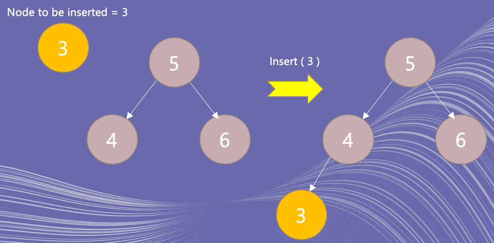
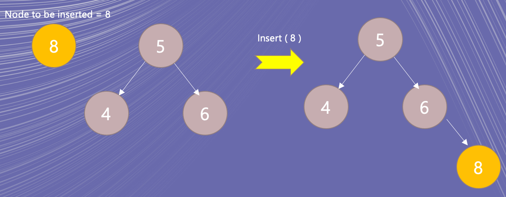

### Binary Search Tree
Write a Binary Search Tree that supports the following operations -

`insert(value) - insert a value`

`contains(value) - search a value `

`remove(value) - remove a value`

### Solution:

First thing first - Let's create a BST Node as shown below -
```
class BSTNode {
    value: number;
    left: BSTNode|null;
    right: BSTNode|null;
}
```
In the above, the *left* and *right* child could be **null** and hence the null notation there.

In the Binary Search Tree, the **hardest part** is the **remove operation** and therefore we'll deal it at the last.

#### Insert operation
Algorithm for _Insert_ operation is simple -

* Identify which subtree (left or right) does the value to be inserted belongs to.
  * If it's a left/subtree: 
    * If the left/subtree is empty, `node.left = new BSTNode(value) `
    
    * Else, `node.left.insert(value)`
  * If it's a right/subtree:
      * If the right/subtree is empty, `node.right = new BSTNode(value) `
      
      * Else, `node.right.insert(value)`

#### Contains (or Find) operation
This is similar to the _Insert operation_ in that when the _left_ or _right_ child is empty, we return _false_ (instead of creating new Node)
* Identify which subtree (left or right) does the value to be inserted belongs to.
  * If it's a left/subtree:
    * If the left/subtree is empty, `return false`
    * Else, `return node.left.contains(value)`
  * If it's a right/subtree:
    * If the right/subtree is empty, `return false`
    * Else, `return node.right.contains(value)`

#### Remove operation
Now the _bread and butter_ of BST Algorithm

For the _remove operation_, **we would need a Parent node** for each node element. This will become clear when we explain the algorithm.

**Case 1:** When the node to be deleted has both children.

In this case, we **don't need the parent node** because for this case, the node's value will be replaced by the **minValue of the right subtree** and that'll happen whether the node is root or intermediate node.

Note: MinValue of SubTree is the **value of left most node**

**Case 2:** When the node has only one child and **has Parent**
  * If the node has left child only
    * Find the subtree of the parent where the node belongs to and assign `parent.[subtree = left or right] = node.left`
  * If the node has right child only
    * Find the subtree of the parent where the node belongs to and assign `parent.[subtree = left or right] = node.right`

**Case 3:** When the node has only one child and **has no Parent** --> it's a ROOT node
  * If the node has left child only
    * node.right = node.left.right
    * node.left = node.left.left 
  * If the node has right child only
    * node.left = node.right.left
    * node.right = node.right.right

**Case 4:** When the node is the ROOT node and no child

This is the **extreme edge case,** and it depends on the interviewer. If he wants to prohibit deleting a node if it's the only node, just return it.
Else, remove the ROOT node and return null.
