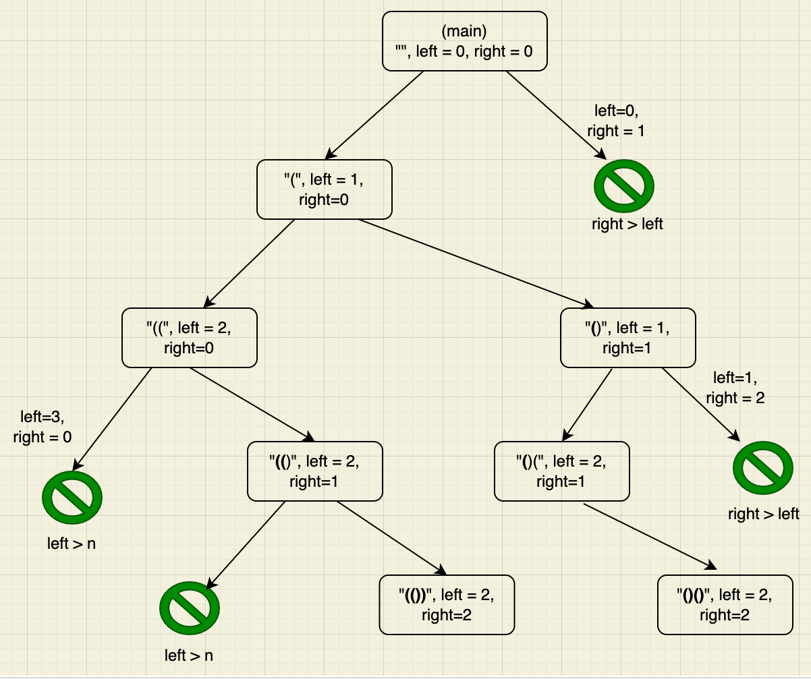

### Problem statement
Given n pairs of parentheses, write a function to generate all combinations of well-formed parentheses.

#### Example 1:

	Input: n = 3

	Output: ["((()))","(()())","(())()","()(())","()()()"]

#### Example 2:

	Input: n = 1
	Output: ["()"]

Note: If you want to really test whether a person knows recursion well, this is the one!

### Approach

Follow this diagram for n = 2.

There will be two recursions - one for handling left brackets, and one for handling right brackets

Use two pointers - `left` and `right` each tracking the number of brackets

For the first recursion -

	populate left brackets for left < n

For the second recursion -

	populate right brackets for right < left

Code:

  	function recur(prefix, left, right) {
		if(len(prefix) == n) save prefix as a solution

		if(left < n)
			recur(prefix + "(", left + 1, right)

		if(right < left)
			recur(prefix + ")", left, right + 1)
  	}

